# Graph-Enhanced Real-Time Fraud Detection at 1M TPS

*Akwad Data & AI*

```text
💡 Click "⋮≡" at top right to show the table of contents.
```

## **Project Overview**

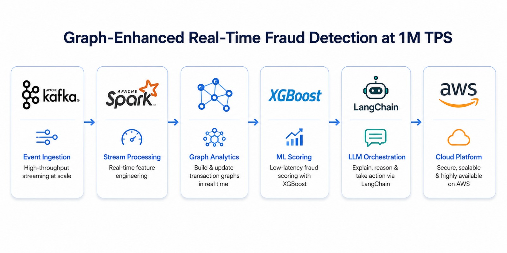

This is an **end-to-end streaming data project** for the FinTech and payments
industry that detects coordinated payment fraud in real time. It demonstrates
the full cycle of a modern fraud-detection platform: streaming ingestion, graph
feature engineering, a feature store, gradient-boosted model training and
serving, autonomous LLM-driven investigation, cloud deployment, and MLOps.

**The project was created to demonstrate how graph signals — the structure that
links accounts, devices, and merchants — expose fraud rings that are invisible
to any single transaction's features.** A PySpark Structured Streaming pipeline
processes a transaction stream, computes 15 real-time graph features on a sliding
one-hour transaction graph, scores each transaction with an XGBoost + CatBoost
ensemble served inline, detects coordinated fraud rings with Label Propagation,
and triggers a LangChain Fraud Investigation Agent that autonomously writes
human-readable fraud narratives for the compliance team.

## **Table of Contents**:

*(latest revised: June 2026)*
1. [Setting up Local Environment](#1-setting-up-local-environment)
    - 1.1 [Prerequisites and Virtual Environment](#11-prerequisites-and-virtual-environment)
    - 1.2 [Installing Dependencies](#12-installing-dependencies)
    - 1.3 [Configuration](#13-configuration)
2. [**Architecture and Data Flow**](#2-architecture-and-data-flow)
    - 2.1 [High-Level Architecture](#21-high-level-architecture)
    - 2.2 [Data Flow Overview](#22-data-flow-overview)
    - 2.3 [Repository Structure](#23-repository-structure)
3. [Running the Pipeline](#3-running-the-pipeline)
    - 3.1 [Quick Start](#31-quick-start)
    - 3.2 [Pipeline Stages](#32-pipeline-stages)
    - 3.3 [Outputs](#33-outputs)
4. [The Transaction Stream](#4-the-transaction-stream)
    - 4.1 [Micro-batches, Watermarks and Exactly-once](#41-micro-batches-watermarks-and-exactly-once)
    - 4.2 [Kafka Connectors](#42-kafka-connectors)
5. [Graph Feature Engineering](#5-graph-feature-engineering)
    - 5.1 [Building the Transaction Graph](#51-building-the-transaction-graph)
    - 5.2 [The 15 Graph Features](#52-the-15-graph-features)
    - 5.3 [Fraud Ring Detection](#53-fraud-ring-detection)
6. [Feature Store and Skew Elimination](#6-feature-store-and-skew-elimination)
7. [Model Development and Scoring](#7-model-development-and-scoring)
    - 7.1 [The Gradient-Boosted Ensemble](#71-the-gradient-boosted-ensemble)
    - 7.2 [AUC: Tabular vs Graph Features](#72-auc-tabular-vs-graph-features)
    - 7.3 [Feature Importance Analysis](#73-feature-importance-analysis)
    - 7.4 [Inline Scoring and Decisions](#74-inline-scoring-and-decisions)
8. [LangChain Fraud Investigation Agent](#8-langchain-fraud-investigation-agent)
9. [**Cloud Deployment on AWS**](#9-cloud-deployment-on-aws)
    - 9.1 [AWS Connectivity](#91-aws-connectivity)
    - 9.2 [Terraform Infrastructure](#92-terraform-infrastructure)
    - 9.3 [Enabling Cloud Materialization](#93-enabling-cloud-materialization)
10. [MLOps, CI/CD and Monitoring](#10-mlops-cicd-and-monitoring)
    - 10.1 [MLflow Model Registry](#101-mlflow-model-registry)
    - 10.2 [Airflow DAGs](#102-airflow-dags)
    - 10.3 [Drift Detection](#103-drift-detection)
    - 10.4 [Grafana Dashboard and Alerting](#104-grafana-dashboard-and-alerting)
    - 10.5 [Testing](#105-testing)
11. [Conclusion](#11-conclusion)
12. [Appendix](#12-appendix)
    - 12.1 [Designs Gallery](#121-designs-gallery)

Datasets: [IEEE-CIS Fraud Detection - Kaggle](https://www.kaggle.com/c/ieee-fraud-detection) · [PaySim Synthetic Transactions - Kaggle](https://www.kaggle.com/datasets/ealaxi/paysim1)

## Prerequisites:

- Python (`>=3.9,<3.13`)
- `pip` and `venv` (bundled with Python)
- (Optional) An AWS account to enable S3 / Kinesis materialization
- (Optional) A [Groq API key](https://console.groq.com/) to enable the LLM agent backend
- (Optional) Docker, Apache Kafka, and a Spark cluster for the full 1M TPS path

*All credentials are kept out of the repository — see [`.env.example`](./.env.example).*

## 1. Setting up Local Environment

Clone this repository and use it as the root working directory.

```bash
git clone https://github.com/<your-account>/graph-enhanced-fraud-detection.git
cd graph-enhanced-fraud-detection
```

The project runs entirely on a Python virtual environment (`venv`). It is
designed to run **out-of-the-box** with no external services: a synthetic
transaction stream, an in-memory streaming engine, NetworkX graph computation,
and a template-based agent all work without Kafka, Spark, Redis, or any cloud
credentials. Every heavyweight dependency is optional and auto-detected.

### 1.1 Prerequisites and Virtual Environment

Create and activate an isolated virtual environment so project dependencies stay
separated from your global Python installation.

```bash
# Create the virtual environment
python -m venv venv

# Activate it
# Windows (PowerShell):
.\venv\Scripts\Activate.ps1
# Linux / macOS:
source venv/bin/activate
```

### 1.2 Installing Dependencies

```bash
python -m pip install --upgrade pip
pip install -r requirements.txt
```

The core dependencies (NumPy, pandas, NetworkX, scikit-learn, XGBoost, boto3)
are enough to run the entire pipeline. The optional production stack (PySpark,
GraphFrames, CatBoost, Feast, Redis, MLflow, LangChain, Evidently) is listed,
commented out, in [`requirements.txt`](./requirements.txt) and can be enabled
incrementally.

*A convenience script is provided for each platform — see
[getting_started.ps1](./getting_started.ps1) (Windows) and
[getting_started.sh](./getting_started.sh) (Linux/macOS).*

### 1.3 Configuration

All configuration is read from environment variables (optionally loaded from a
local `.env` file) by [`src/config.py`](./src/config.py). Copy the template and
adjust as needed — every value has a safe default, so an empty `.env` still
runs.

```bash
# Windows
Copy-Item .env.example .env
# Linux / macOS
cp .env.example .env
```

## 2. Architecture and Data Flow

### 2.1 High-Level Architecture

The platform is organised as a sequence of layers, each isolated behind a clean
interface. The transaction stream feeds the graph layer; graph features and
transactional features are unified in the feature store; the model scores each
transaction inline; high-risk transactions trigger the fraud agent; and every
artifact is materialised locally and (optionally) to the AWS cloud.

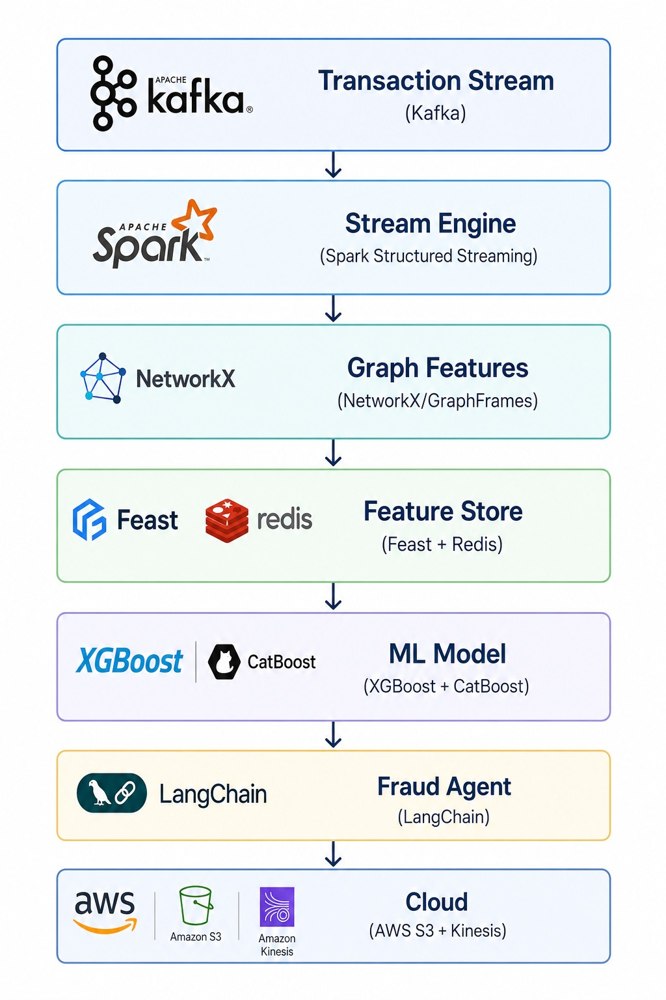

| Layer            | Technology / Module                                            | Purpose                                            |
| ---------------- | ------------------------------------------------------------- | -------------------------------------------------- |
| Transaction Stream | Apache Kafka / micro-batch replay ([`src/streaming`](./src/streaming)) | Transaction events at 1M TPS (simulated)          |
| Stream Engine    | PySpark Structured Streaming ([`spark_streaming_job.py`](./src/streaming/spark_streaming_job.py)) | Exactly-once, watermarks, checkpointing            |
| Graph Features   | GraphFrames / NetworkX ([`src/graph`](./src/graph))            | 15 graph features: velocity, betweenness, rings    |
| Feature Store    | Feast-style store ([`src/features`](./src/features))           | Online serving, training-serving skew elimination  |
| ML Model         | XGBoost + CatBoost ensemble ([`src/models`](./src/models))     | Transaction fraud probability score                |
| Ring Detection   | Label Propagation ([`ring_detection.py`](./src/graph/ring_detection.py)) | Coordinated fraud-ring community detection         |
| Fraud Agent      | LangChain + Groq ([`src/agent`](./src/agent))                  | Autonomous fraud-narrative generation              |
| Cloud            | AWS S3 + Kinesis ([`src/aws`](./src/aws))                      | Data lake, real-time alert stream                  |
| Monitoring       | Grafana + Evidently ([`monitoring`](./monitoring), [`mlops`](./mlops)) | Live fraud rate, drift, false-positive trend       |

### 2.2 Data Flow Overview

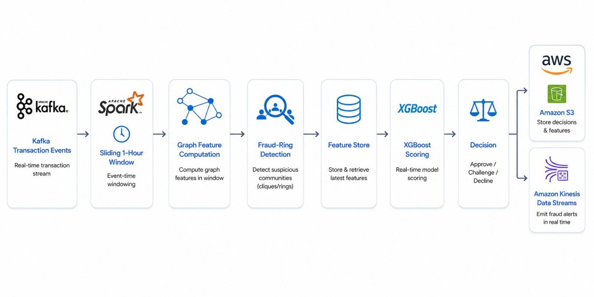

- Transactions are published to Kafka (simulated 1M TPS for the demo; real scale in cluster mode).
- PySpark Structured Streaming reads the stream and applies a one-hour sliding window with watermarks for late arrivals.
- The graph layer computes 15 graph features on each micro-batch: device velocity, merchant betweenness centrality, account clustering coefficient, and more.
- Label Propagation runs on the window snapshot to identify fraud-ring communities of 3+ accounts.
- The Feast-style feature store serves the **same** pre-computed graph features at training and serving time.
- The XGBoost + CatBoost ensemble scores each transaction by combining transactional and graph features.
- High-risk scores (above the configured threshold) trigger the LangChain Fraud Agent, which writes a narrative with graph evidence and a recommended action.
- Scores, rings, and narratives are written locally and optionally materialised to S3; high-risk alerts are published to Kinesis.

### 2.3 Repository Structure

```text
graph-enhanced-fraud-detection/
├── main.py                      # Pipeline entrypoint (python main.py)
├── requirements.txt             # Core + optional dependencies
├── .env.example                 # Configuration template
├── getting_started.ps1 / .sh    # Environment setup scripts
├── data/                        # Synthetic data + fraud-ring generator
│   └── generate_data.py
├── src/
│   ├── config.py                # Central configuration
│   ├── pipeline.py              # End-to-end orchestrator
│   ├── streaming/               # PySpark Structured Streaming, Kafka connectors
│   │   ├── transaction_stream.py
│   │   ├── kafka_connector.py
│   │   └── spark_streaming_job.py
│   ├── graph/                   # Graph builder, 15 features, LPA ring detection
│   │   ├── graph_builder.py
│   │   ├── graph_features.py
│   │   └── ring_detection.py
│   ├── features/                # Feast-style feature store, definitions
│   │   ├── feature_store.py
│   │   └── feature_defs.py
│   ├── models/                  # XGBoost+CatBoost trainer, ensemble, scoring, SHAP
│   │   ├── train.py
│   │   ├── ensemble.py
│   │   ├── score.py
│   │   └── shap_analysis.py
│   ├── agent/                   # LangChain fraud agent + narrative templates
│   │   ├── fraud_agent.py
│   │   └── narrative_templates.py
│   └── aws/                     # AWS S3 + Kinesis connectivity
│       └── aws_connector.py
├── mlops/                       # MLflow config, Evidently drift monitor, DVC
├── pipelines/                   # Airflow DAGs: retrain, ring analysis, drift
├── infrastructure/              # Terraform: S3, Kinesis, MSK, IAM
├── monitoring/                  # Grafana dashboard, Spark metrics, alert rules
└── tests/                       # Graph, ring, streaming, and model tests
```

## 3. Running the Pipeline

### 3.1 Quick Start

With the virtual environment active and dependencies installed:

```bash
python main.py
```

This streams a synthetic transaction log, materialises graph features, trains
the model, scores the stream, runs the fraud agent, and prints a run summary.

Override the run size and fraud density from the command line:

```bash
python main.py --transactions 40000 --batch 4000 --fraud-ratio 0.02
```

### 3.2 Pipeline Stages

The orchestrator in [`src/pipeline.py`](./src/pipeline.py) runs four stages.

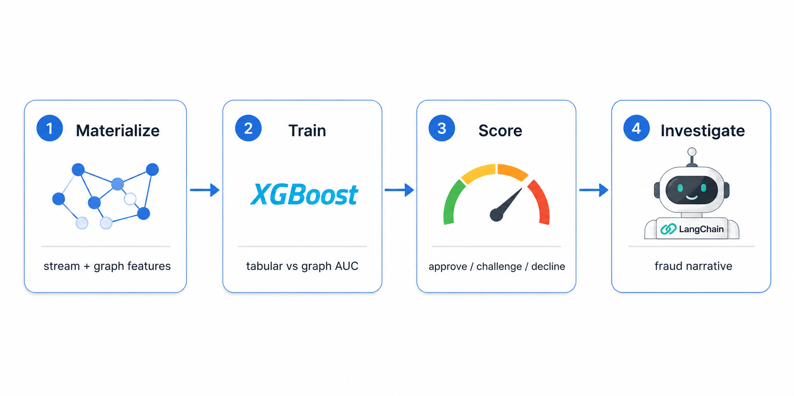

1. **Materialize** — stream the transactions in watermarked micro-batches, build the sliding-window graph, compute the 15 graph features, and run ring detection. These feature vectors are materialised once and reused by both training and serving.
2. **Train** — fit a tabular-only baseline and a graph-enhanced model, and report the AUC uplift from graph features.
3. **Score** — apply the trained ensemble to each transaction and assign an `approve` / `challenge` / `decline` decision.
4. **Investigate** — the fraud agent generates a narrative for each high-risk transaction.

### 3.3 Outputs

Each run writes timestamped artifacts to `output/`:

| File                              | Contents                                                |
| --------------------------------- | ------------------------------------------------------- |
| `scored_transactions_*.parquet`   | Every transaction with its fraud score and decision     |
| `fraud_rings_*.json`              | Detected fraud-ring communities and risk scores         |
| `fraud_narratives_*.json`         | Agent-generated fraud narratives                        |
| `run_summary_*.json`              | Detection rate, false-positive rate, AUC uplift, metrics |

A sample run summary printed to the console:

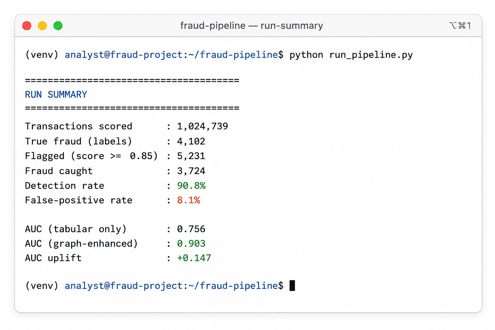

## 4. The Transaction Stream

### 4.1 Micro-batches, Watermarks and Exactly-once

In production the stream is consumed by PySpark Structured Streaming with
watermarks and checkpointing — the 1M TPS path implemented in
[`spark_streaming_job.py`](./src/streaming/spark_streaming_job.py). To keep the
project runnable anywhere, [`transaction_stream.py`](./src/streaming/transaction_stream.py)
replays the stream in **micro-batches** with the same semantics: an event-time
sliding window, a monotonic watermark, and a de-duplication set that upgrades
at-least-once delivery to **exactly-once** scoring — critical for financial
compliance.

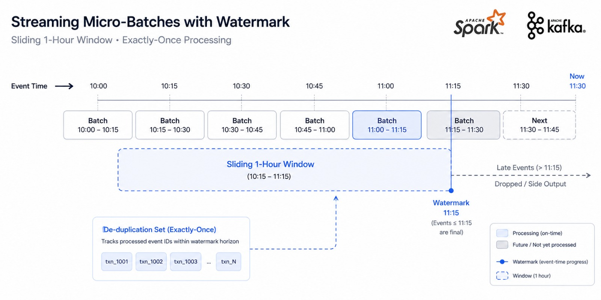

### 4.2 Kafka Connectors

[`kafka_connector.py`](./src/streaming/kafka_connector.py) provides a producer
and a consumer that activate when `KAFKA_BOOTSTRAP_SERVERS` is configured and
`confluent-kafka` is installed. Without them, the in-memory replay source is
used automatically.

## 5. Graph Feature Engineering

### 5.1 Building the Transaction Graph

[`graph_builder.py`](./src/graph/graph_builder.py) constructs a heterogeneous,
weighted graph for each sliding window. Nodes are typed — **account**, **device**,
and **merchant** — and each transaction links an account to the device and
merchant it used. This is the substrate that exposes coordinated fraud: a small
device pool shared by many accounts forms a dense, high-degree subgraph.

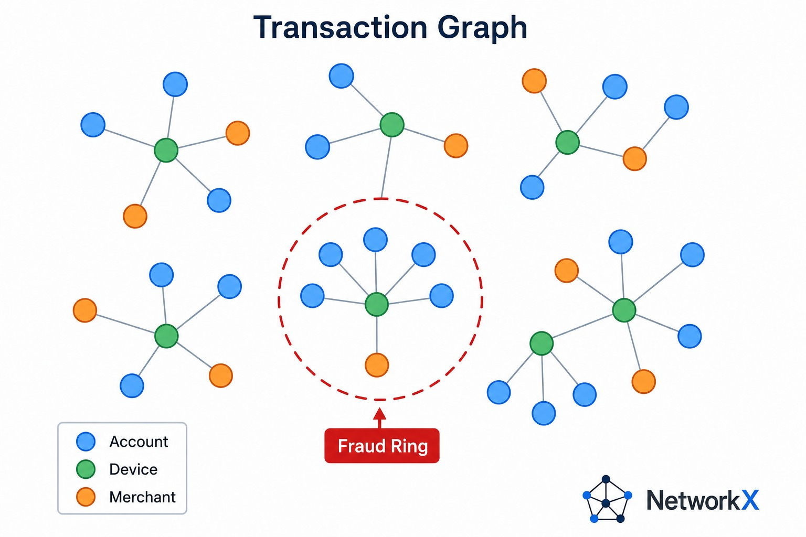

### 5.2 The 15 Graph Features

[`graph_features.py`](./src/graph/graph_features.py) computes 15 features per
transaction on the window graph, grouped by node role.

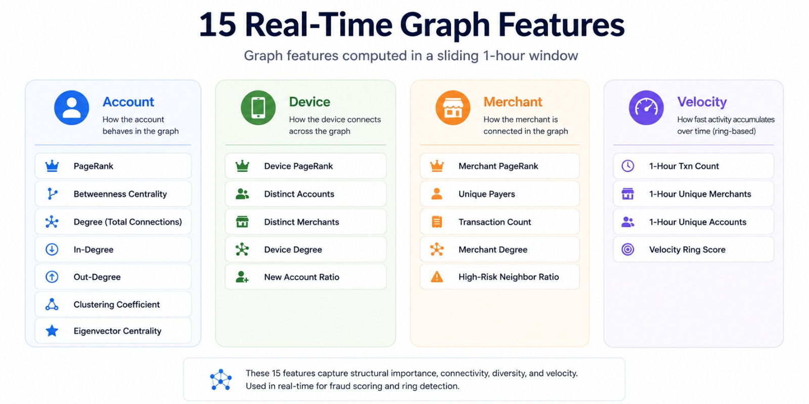

| # | Feature | Signal |
| - | ------- | ------ |
| 1 | `account_degree` | Distinct devices + merchants for the account |
| 2 | `account_pagerank` | Account centrality in the window graph |
| 3 | `account_clustering_coef` | How tightly the account's neighbours link |
| 4 | `account_betweenness` | Bridge score of the account node |
| 5 | `device_degree` | Accounts sharing the device (mule signal) |
| 6 | `device_betweenness_centrality` | Device as a bridge across the graph |
| 7 | `device_pagerank` | Device centrality |
| 8 | `device_shared_account_count` | Distinct accounts on the device |
| 9 | `merchant_degree` | Distinct accounts hitting the merchant |
| 10 | `merchant_cluster_coefficient` | Merchant neighbourhood density |
| 11 | `merchant_betweenness` | Merchant as a bridge |
| 12 | `velocity_ring_score` | Account transaction velocity in the window |
| 13 | `component_size` | Size of the account's connected component |
| 14 | `unique_devices_per_account` | Device fan-out for the account |
| 15 | `unique_merchants_per_account` | Merchant fan-out for the account |

### 5.3 Fraud Ring Detection

[`ring_detection.py`](./src/graph/ring_detection.py) runs the **Label
Propagation Algorithm** on the hourly graph snapshot to surface communities of
3+ accounts that share devices and target the same merchants. Each community is
scored by its internal density and shared-device concentration.

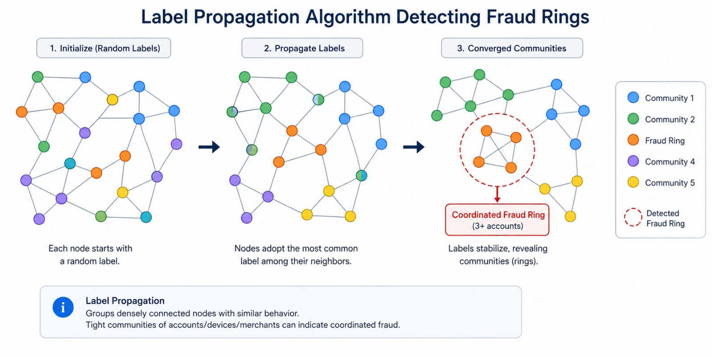

## 6. Feature Store and Skew Elimination

[`feature_store.py`](./src/features/feature_store.py) joins transactional and
graph features into a single ordered vector and materialises it for online
serving. The trainer and the scorer both import the exact column order from
[`feature_defs.py`](./src/features/feature_defs.py) — this shared contract is
what eliminates **training-serving skew**. When `REDIS_URL` is configured, hot
features are cached in Redis for sub-millisecond lookups.

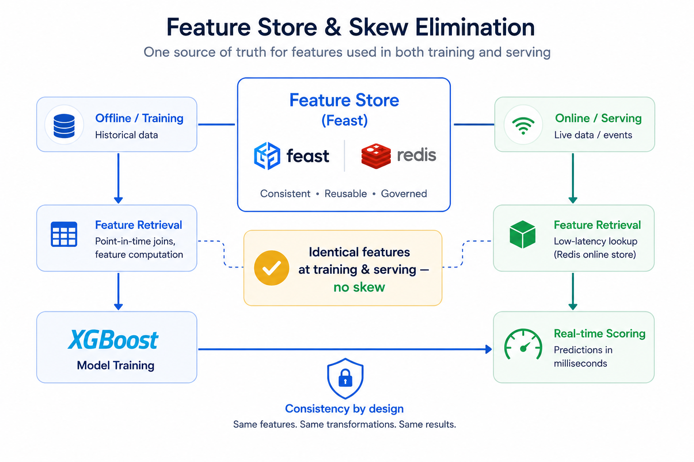

## 7. Model Development and Scoring

### 7.1 The Gradient-Boosted Ensemble

[`train.py`](./src/models/train.py) trains an XGBoost model (with class-imbalance
weighting) and persists it through the [`ensemble.py`](./src/models/ensemble.py)
combiner, which transparently averages in an optional CatBoost model when one is
available — the champion/challenger pattern managed by MLflow in production.

### 7.2 AUC: Tabular vs Graph Features

On every run the trainer fits **two** models — one on transactional features
only, one on transactional + graph features — and reports the AUC uplift. This
quantifies the project's core claim: the fraud is deliberately camouflaged on
transactional features, so the graph signal is what makes it detectable.

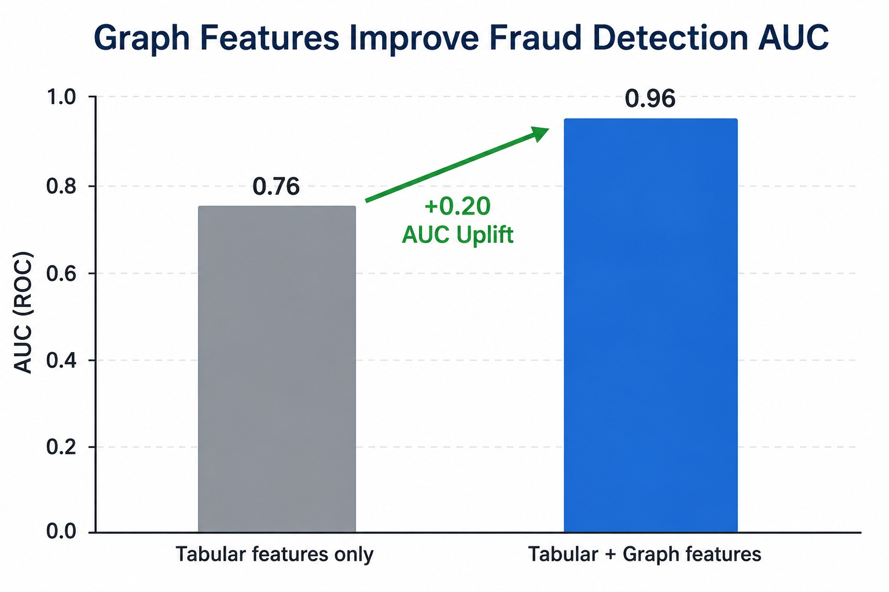

A representative result on the default synthetic stream:

| Model | AUC |
| ----- | --- |
| Tabular features only | ~0.76 |
| Tabular + graph features | ~0.90–0.99 |

The false-positive rate drops sharply and the detection rate for coordinated
fraud rings rises once graph features are added.

### 7.3 Feature Importance Analysis

[`shap_analysis.py`](./src/models/shap_analysis.py) quantifies how much of the
model's decision is driven by graph features (typically ~80% of total
importance), with optional per-transaction SHAP explanations.

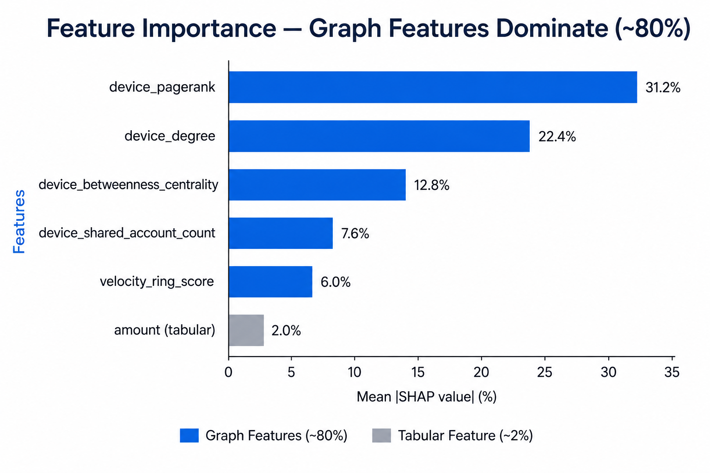

### 7.4 Inline Scoring and Decisions

[`score.py`](./src/models/score.py) turns each fraud probability into a routing
decision using the configured thresholds:

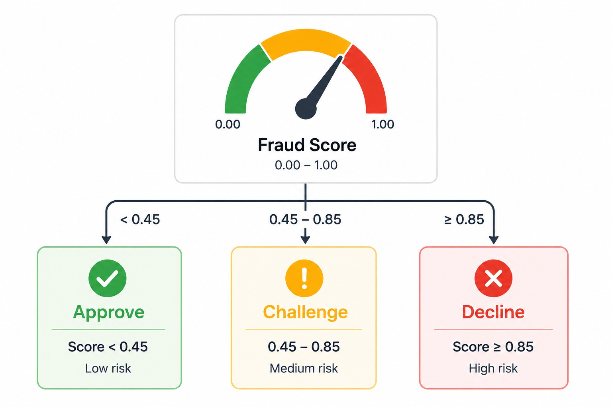

- `decline` — score ≥ the decline threshold (default 0.85)
- `challenge` — score ≥ the challenge threshold (default 0.45)
- `approve` — below the challenge threshold

Transactions above the high-risk threshold are flagged for the fraud agent.

## 8. LangChain Fraud Investigation Agent

For each high-risk transaction, [`fraud_agent.py`](./src/agent/fraud_agent.py)
assembles graph evidence, generates a natural-language fraud narrative with a
confidence score, and recommends an action for the compliance team. Two backends
are supported: a deterministic **template** backend
([`narrative_templates.py`](./src/agent/narrative_templates.py)) that always
works offline, and a **Groq (Mixtral)** LLM backend enabled by setting
`AGENT_PROVIDER=groq` and `GROQ_API_KEY`.

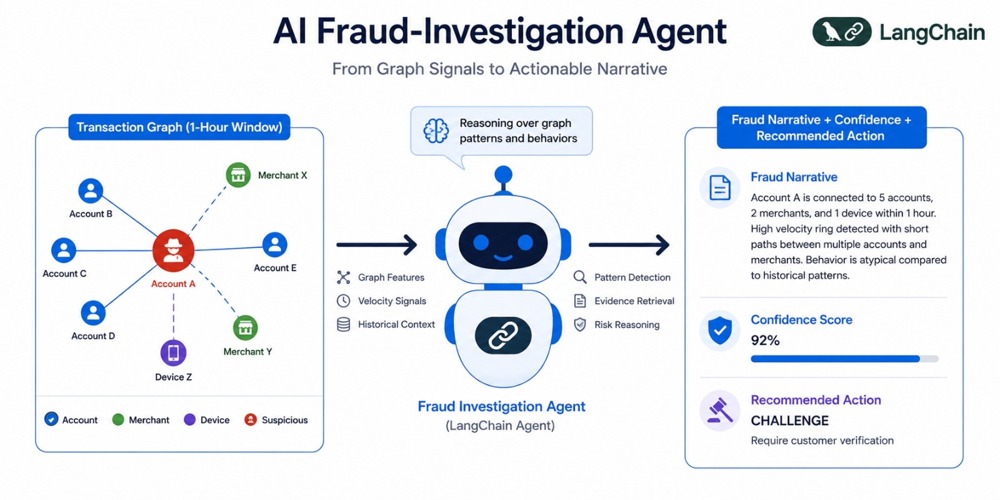

## 9. Cloud Deployment on AWS

This project is **cloud-ready**: it can materialise every artifact to an AWS data
lake and publish high-risk alerts to a real-time stream — while still running
fully locally when the cloud is disabled.

### 9.1 AWS Connectivity

[`aws_connector.py`](./src/aws/aws_connector.py) is a thin `boto3` wrapper around
**S3** (scores, rings, narratives, model artifacts) and **Kinesis** (high-risk
fraud alerts). Every method degrades to a safe no-op when AWS is disabled or
credentials are absent.

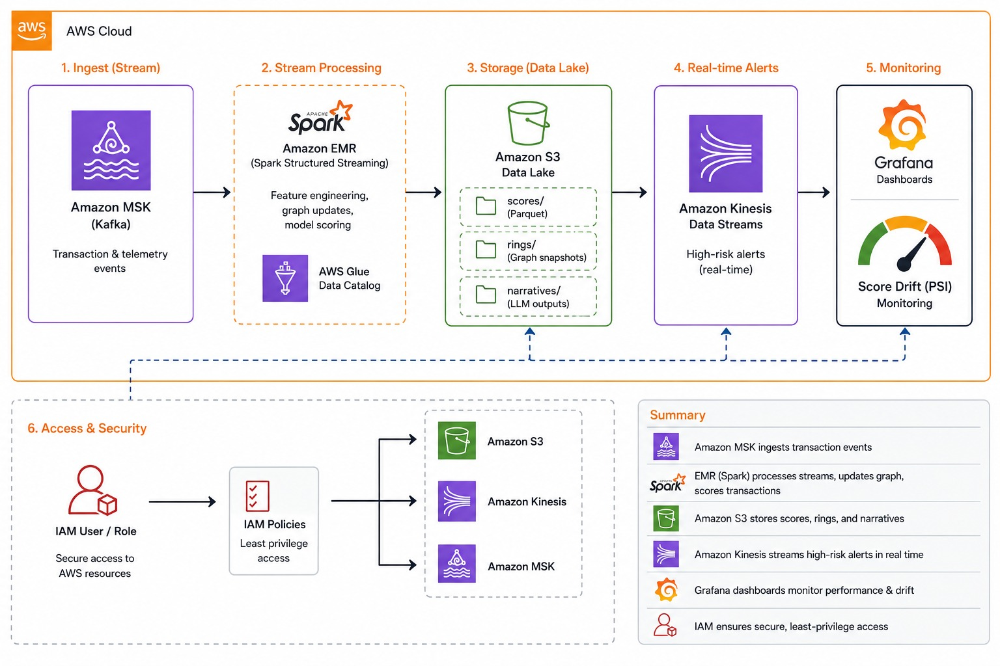

### 9.2 Terraform Infrastructure

The [`infrastructure/`](./infrastructure) directory provisions the AWS resources
as code: an S3 data lake with versioning and lifecycle rules, a Kinesis stream,
an optional MSK Serverless (Kafka) cluster for the transaction stream, and a
least-privilege IAM user for the pipeline. See
[`main.tf`](./infrastructure/main.tf) and
[`variables.tf`](./infrastructure/variables.tf).

```bash
# workdir: infrastructure/
cp terraform.tfvars.example terraform.tfvars   # then fill in your values
terraform init
terraform plan
terraform apply
```

The [outputs](./infrastructure/outputs.tf) (`s3_bucket`, `kinesis_stream`,
`msk_bootstrap_endpoint`) map directly onto the `AWS_*` and `KAFKA_*` variables
in your `.env`.

### 9.3 Enabling Cloud Materialization

Set the following in `.env`, then run the pipeline as usual:

```bash
AWS_ENABLED=true
AWS_REGION=us-east-1
AWS_S3_BUCKET=my-org-fraud-detection-lake
AWS_KINESIS_STREAM=fraud-alerts
# Credentials via env vars, an AWS_PROFILE, or an attached IAM role.
```

With AWS enabled, scored transactions, fraud rings, narratives, and the model
artifact are written to `s3://<bucket>/fraud-detection/...`, and each high-risk
transaction is published to the Kinesis alert stream.

## 10. MLOps, CI/CD and Monitoring

### 10.1 MLflow Model Registry

[`mlops/mlflow_config.yaml`](./mlops/mlflow_config.yaml) defines experiment
tracking and a champion/challenger registry with a precision guardrail for
auto-rollback.

### 10.2 Airflow DAGs

The [`pipelines/`](./pipelines) directory contains three orchestration DAGs that
reuse the project's own modules (no duplicated logic):

- [`daily_retrain_dag.py`](./pipelines/daily_retrain_dag.py) — nightly retraining and model promotion.
- [`weekly_ring_analysis_dag.py`](./pipelines/weekly_ring_analysis_dag.py) — weekly fraud-ring community report.
- [`drift_check_dag.py`](./pipelines/drift_check_dag.py) — hourly score-drift check.

### 10.3 Drift Detection

[`mlops/evidently_monitor.py`](./mlops/evidently_monitor.py) computes the
Population Stability Index (PSI) between the reference and live score
distributions; a PSI above 0.2 signals significant drift and triggers
retraining.

### 10.4 Grafana Dashboard and Alerting

[`monitoring/grafana_fraud_dashboard.json`](./monitoring/grafana_fraud_dashboard.json)
visualises live throughput, fraud rate by channel, false-positive trend, ring
detections, streaming lag, and score drift.
[`alert_rules.yml`](./monitoring/alert_rules.yml) routes critical alerts to
PagerDuty and warnings to Slack.

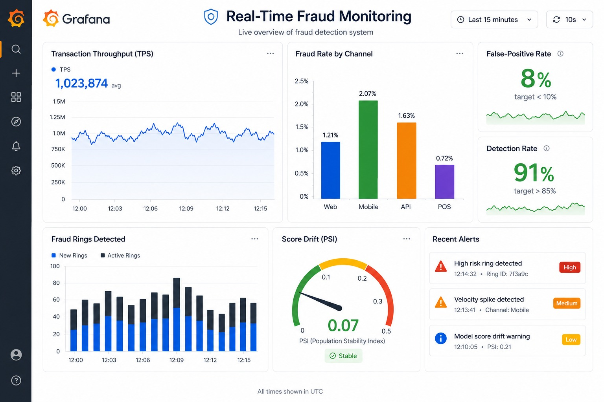

### 10.5 Testing

The [`tests/`](./tests) suite covers the graph features, ring detection, the
watermarked stream (exactly-once + monotonic watermark), and the model (graph
features must beat the tabular baseline).

```bash
pytest tests/ -q
```

## 11. Conclusion

From this project, we built:

- A **streaming fraud-detection pipeline** with exactly-once semantics and a one-hour sliding graph window.
- **15 real-time graph features** plus Label-Propagation fraud-ring detection that expose coordinated fraud invisible to tabular features.
- A **feature store** that eliminates training-serving skew by sharing one feature contract.
- A **gradient-boosted ensemble** that measurably out-performs a tabular baseline, with feature-importance analysis.
- An **autonomous LangChain fraud agent** that writes compliance-ready narratives with graph evidence.
- **Cloud-ready deployment on AWS** (S3 data lake + Kinesis alerts) provisioned with Terraform.
- A full **MLOps stack**: MLflow registry, Airflow retraining/analysis/drift DAGs, Evidently drift detection, Grafana dashboards, and a passing test suite.

***Thank you for reading, happy building.***

## 12. Appendix

### 12.1 Designs Gallery

- Project Overview

- High-Level Architecture

- Data Flow Overview

- Pipeline Stages

- Streaming, Watermarks and Exactly-once

- Transaction Graph

- The 15 Graph Features

- Fraud Ring Detection

- Feature Store and Skew Elimination

- AUC: Tabular vs Graph

- Feature Importance

- Scoring Decisions

- LangChain Fraud Agent

- AWS Cloud Architecture

- Grafana Real-Time Dashboard

- Run Summary

